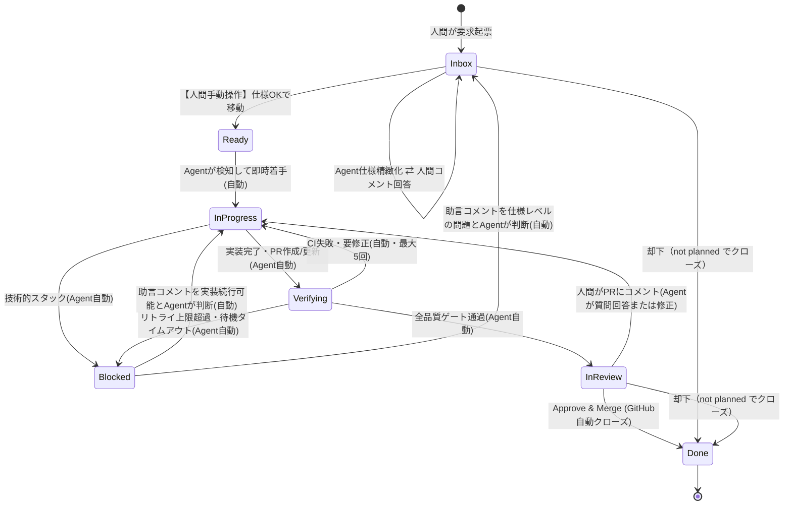

# 自動開発パイプライン設計ドキュメント (v0.1)

GitHub Projects をステートマシンの「単一の真実源」として使い、人間は「曖昧な要求を書く」「Readyを判断する」「最終レビュー・マージ判断をする」の3点にのみ関与し、それ以外（要件精緻化・実装・テスト・セルフレビュー・検証）は自律エージェントが行うパイプラインを設計する。

## 1. 目的とスコープ

- 人間の関与を最小化し、意思決定ポイント（ゲート）に集中させる。
- エージェントは Issue の Status を見て「次に自分が何をすべきか」を自己判断できる。
- Status の遷移がそのままパイプラインの進行ログになる（Projects の Board / Timeline がそのまま可視化ツールになる）。
- v0.1 では「ステータス定義」「ユーザーストーリー」「ユーザーシナリオ」の合意を目的とし、実装方式（どのランタイムでエージェントを動かすか等）には踏み込まない。実装方式は [ARCHITECTURE.md](./ARCHITECTURE.md) に分離する。

## 2. 登場人物（ロール）

| ロール | 説明 |
|---|---|
| Requester（依頼者） | 曖昧な要求を Issue として書き起こす人 |
| Approver（Ready判断者） | エージェントが精緻化した要件を見て、実装に進めてよいか（Ready）を判断する人 |
| Reviewer（レビュアー） | 実装完了後、PRの最終レビューとマージ可否を判断する人 |
| Agent（自律エージェント） | Status を起点に次のアクションを判断し、要件精緻化・実装・テスト・セルフレビュー・検証を自律的に行う |

Requester / Approver / Reviewer は同一人物であることを想定する。

## 3. ユーザーストーリー

### Requester
- 曖昧な思いつきレベルの要求でも、Issue を1つ書くだけでパイプラインに乗せられるようにしたい。詳細な仕様を自分で書く負担をなくすため。
- 自分が書いた要求に対してエージェントがどう解釈したか（精緻化された仕様）を、実装が始まる前に確認できるようにしたい。誤解に基づいた実装が進んでしまうのを防ぐため。

### Approver
- エージェントが精緻化した要件（背景・目的・非スコープ・受け入れ条件）を1画面で確認し、Ready / 差し戻し / 却下 のいずれかを即断できるようにしたい。判断コストを最小化するため。
- Ready にする前に、不明点があればコメントで指摘するだけでエージェントが再度精緻化してくれるようにしたい。仕様を自分で書き直す必要をなくすため。

### Reviewer
- エージェントが実装・テスト・セルフレビュー・検証まで完了した状態でPRが上がってくることを期待したい。コードレビューに集中でき、実装の妥当性確認に時間を使わずに済むため。
- レビューで変更を要求した場合、自分がタスクの状態管理をしなくても、エージェントが自動で再着手してくれるようにしたい。差し戻し後のフォローアップ漏れを防ぐため。
- エージェントが自力で解決できない問題（例: テストが恒常的に落ちる、要件と実装が矛盾する）に直面した場合は、黙って止まるのではなく明示的にブロック状態として通知してほしい。放置されたタスクに気づけないリスクを避けるため。

### Agent（システム要求として）
- Issue の Status と、そこに発生したイベント（コメント投稿・ステータス変更など）の組み合わせから、次に自分がすべきアクション（精緻化 / 実装 / 検証 / 待機）を一意に判断できるようにしたい。人間からの都度の指示なしに自律動作するため。
- 自分の判断で解決できない曖昧さやブロッカーに遭遇した場合、状態を明示的に変更して人間にエスカレーションできるようにしたい。無限ループや誤った推測での実装を避けるため。

## 4. GitHub Project ステータス定義

Status は単一選択（Single select）フィールドとして Project に持たせる。
ボード上のカードは **「Issue」を単一の真実源（1タスク＝1カード）** として扱い、PR はその成果物として Issue にリンク（`Closes #Issue番号`）する。

### 基本原則：人間の明示的なステータス変更は「Ready」の1回のみ

常駐の監視ワーカーが常に全レーンを監視しており、**人間が手動でステータスを変更するのは「Inbox → Ready」の1回だけ**。
それ以外の復帰（レビュー修正、Blocked救済、仕様質問への回答）はすべて **「ユーザーがコメントを投稿した瞬間にエージェントが叩き起こされ、自動で適切なステータスに変更して自走する」** イベント駆動モデルとする。

### 基本原則：終端は「Done」のみ

完了も却下も **Issue のクローズ**で表現し、Status はいずれも `✅ Done` とする。
「作られたもの」と「却下されたもの」の区別は GitHub 標準のクローズ理由（`completed` / `not planned`）が保持するため、Status フィールドに二重に持たない。
**クローズされた Issue は理由を問わず終端**であり、以後どのようなイベントが発生してもエージェントは起動しない。

| # | Status | ボール | 入口条件（トリガー） | やること（役割・自動処理） | 出口条件・次の遷移 |
|---|---|---|---|---|---|
| 1 | 📥 **Inbox** | Human & Agent | Requester が Issue 起票<br>（または質問回答コメント） | **要求起票 ＆ 仕様精緻化・対話**<br>・Agent が背景・目的・受入条件を精緻化し本文更新<br>・疑問点があればコメントで質問し、人間がコメントで回答<br>・仕様完成時、Agent が「Ready へ移動してください」と通知 | 人間が `🎯 Ready` へ移動<br>（不要なら Issue を `not planned` でクローズ → `✅ Done`） |
| 2 | 🎯 **Ready** | **🧑 Human Gate** | 人間が仕様を確認し移動<br>（**唯一の手動操作**） | **人間の着手承認（着手ゲート）**<br>「仕様に合意し、実装を開始してよい」と人間が判断した状態 | Agent が検知次第、即座に `🚧 In Progress` へ自動遷移 |
| 3 | 🚧 **In Progress** | **🤖 Agent** | Ready 検知 / 検証失敗の差し戻し / PRコメント検知 / Blocked助言コメント検知 | **実装（Agent が稼働中の唯一のレーン）**<br>1. ブランチ作成 ＆ 実装<br>2. ローカルテスト実行<br>3. PR 作成 / 更新（`Closes #Issue番号`） | PR 作成・更新完了で `🔍 Verifying`<br>技術的スタックで `⏸ Blocked` |
| 4 | 🔍 **Verifying** | **🤖 Agent** | PR 作成・更新完了 | **品質ゲートの検証（エージェントは常駐せず、ワーカーが結果を待つ）**<br>・CI の完了待ちと結果確認<br>・Agent セルフレビュー（不要差分やバグの確認）<br>・**リポジトリ定義の品質ゲート**（Preview 環境での動作確認等） | 全品質ゲート通過で `👀 In Review`<br>CI 失敗・要修正で `🚧 In Progress` に差し戻し（リトライ最大5回）<br>リトライ上限超過・待機タイムアウトで `⏸ Blocked` |
| 5 | 👀 **In Review** | **🧑 Human Gate** | 全検証完了（Agentが移動） | **最終コードレビュー ＆ マージ判断**<br>Reviewer は品質保証済みの PR を確認<br>・Approve & Merge で完了<br>・コメント時は Agent が質問回答または修正実装を自律判断 | Approve & Merge で `✅ Done`<br>PRコメント検知で `🚧 In Progress`（Agent自動）<br>根本却下は Issue を `not planned` でクローズ → `✅ Done` |
| 6 | ⏸ **Blocked** | **🧑 Human Gate** | Agent が自力解決不能と判断 | **人間の技術的介入・助言**<br>Agent が詰まっている理由とログをコメント。<br>人間が助言コメントを投稿すると、Agent が自動で検知して再開 | 助言コメント検知で `🚧 In Progress`（Agent自動）<br>仕様見直しなら `📥 Inbox` |
| - | ✅ **Done** | — | Issue のクローズ | （終端）マージ時は `Closes #1` により Issue が自動クローズされ完了。却下時は `not planned` でクローズ | — |

---

### 設計のポイント

1. **人間のステータス操作は「Readyへのドラッグ」の1回**:
   - 仕様に納得したら `Ready` に動かす。人間の手動ステータス変更はこれだけ。
   - PR の修正指示も、Blocked の助言も、**コメントを書くだけでエージェントが自動で `In Progress` に戻して作業を再開**する。
   - 完了（`Done`）も却下も Issue のクローズで表現し、Status への反映は自動に任せる。
2. **Project ボード上は「Issue のみ」を表示（PR はカード化しない）**:
   - 二重管理とボードの散らかりを防ぐため、**GitHub Projects には Issue のみを追加し、PR はカードとして追加しない（Issue 単一の真実源原則）**。
   - 進捗は常に Issue カード（`In Progress` → `Verifying` → `In Review` → `Done`）が表し、PR は Issue 内のリンク（`Closes #1`）として参照する。PR マージ時に Issue が自動クローズされ、Issue カードが自動で `Done` に移動する。
3. **「実装」と「検証」をレーンとして分離する**:
   - `In Progress` は **エージェントが実際に稼働しているレーン**（ワークスペースを占有する長時間処理）。
   - `Verifying` は **エージェントが稼働していないレーン**。PR は既に存在し、CI や Preview 環境という外部システムの結果を待っているだけの状態。
   - 分離により、(a) CI 待ちがパイプライン全体を占有しない、(b) 途中でエージェントが異常終了しても Status からどこまで進んだかが判別でき復帰できる、(c) 実装用と検証用でエージェントの役割・権限・コストを分けられる、という利点を得る。
4. **大きな要求のタスク分割（親Issue / 子Issue）と手動クローズ**:
   - 1つのPRで収まらない大きな要求は、Agent が複数の子Issue（Task）に分割し、親Issue から参照する（GitHub の sub-issues 機能を利用する）。
   - 各子Issueは個別に `Ready` → `In Progress` → `Verifying` → `In Review` → `Done` とガンガン自走・消化される。
   - **親Issue自体は仕様の全体像として `Inbox` に留まる**。イベント駆動モデルのため、親Issueにコメントがつかない限りエージェントは起動せず、静止したまま残る。
   - 全子Issueの完了を確認して人間が手動でクローズすると `✅ Done` へ遷移する。
5. **リポジトリごとの品質ゲート定義（CI / Preview）**:
   - リポジトリ特性に応じて、品質ゲート（CIパス、セルフレビュー、Preview環境での動作検証の要否など）をプロンプトで定義する。
   - CI失敗時の自動修正リトライは最大5回とし、超えた場合は `⏸ Blocked` にエスカレーションする。
6. **常駐ワーカーによるイベント駆動 ＆ 直列実行**:
   - 常駐ワーカーが全レーンを監視し、イベント（Ready への移動、コメント追加、Issue クローズ）を検知してエージェントを実行する。
   - 意図的なv0.1の割り切りとして、**エージェントの実行（`In Progress`）は直列（1件ずつ）** で処理する。外部システムの結果待ち（`Verifying`）は並列に存在してよい。
   - コンテキストは最新Issue/PR＋直近10件程度のコメントを基本とする。
   - 検知方式・実行基盤の詳細は [ARCHITECTURE.md](./ARCHITECTURE.md) を参照。

---

### 状態遷移図



## 5. ユーザーシナリオ

### シナリオ1: ハッピーパス（最速・最高品質フロー）
1. Requester が Issue に「〇〇機能が欲しい」と曖昧な要求を書く（`📥 Inbox`）。
2. Agent が検知し、背景・目的・非スコープ・受け入れ条件を書き出して Issue 本文を更新。「仕様精緻化が完了しました。ご確認の上 `Ready` に移動してください」とコメント。
3. Approver が仕様を読み、問題なければカードを `🎯 Ready` にドラッグ。
4. Agent が `Ready` を検知して即座に `🚧 In Progress` に移動し、自律開発を開始：
   - ブランチを切って実装
   - ローカルテストを実行し、PR を作成してプッシュ
5. PR 作成完了で Agent が `🔍 Verifying` に移動。以降エージェントは常駐せず、ワーカーが検証を進める：
   - CI の完了を待機して成功を確認
   - エージェント自身によるセルフレビュー（不要差分やバグの確認）
   - **リポジトリで定義された品質ゲート（Preview環境での動作確認など）を検証**
6. すべてクリアしたら Agent が Issue を `👀 In Review` へ移動し、人間へ通知。
7. Reviewer が PR を確認（品質ゲート通過済みなので安心）し、Approve & Merge。
8. Issue が自動クローズされ、`✅ Done` へ遷移。

### シナリオ2: 要件が曖昧で質問・対話が発生するケース
1. Agent が仕様精緻化中に不明点を発見。
2. Agent は Issue 本文を草案として更新しつつ、コメントで「質問：〇〇の仕様はどうしますか？」と投稿（`📥 Inbox` のまま）。
3. Approver がコメントで回答。
4. 監視ワーカーがコメントを検知して Agent を叩き起こす。Agent が回答を取り込んで仕様本文を完成させ、Ready への移動を促す。
5. Approver が確認し、`🎯 Ready` に移動。

### シナリオ3: PR レビューでコメントがつくケース（完全コメント駆動）
1. `👀 In Review` の PR に対して、Reviewer が質問や修正指示（「ボタンの文言を〇〇に変更してほしい」等）をコメント。
2. 監視ワーカーが PR コメントを検知して Agent を叩き起こす。
3. Agent がコメント内容を自律判断し、質問なら回答コメントを作成、修正指示なら **自動で Issue を `🚧 In Progress` に戻して** 修正実装 → PR 更新。
4. PR 更新後 `🔍 Verifying` に移動し、品質ゲートを再検証。通過したら Agent が自動で `👀 In Review` に戻す。
5. Reviewer が再確認し、Approve & Merge（`✅ Done`）。

### シナリオ4: 検証中にエージェントがブロックされるケース（完全コメント駆動）
1. `🔍 Verifying` で CI が失敗し、`🚧 In Progress` への差し戻しと再修正を5回繰り返しても通らず、自力解決不能と判断。
2. Agent は Issue を `⏸ Blocked` に移動し、「失敗ログ・原因推測・試した内容」をコメントに残す。
3. Reviewer/Approver が確認し、「モジュールA側の設定をモックしてよい」と助言コメントを投稿。
4. 監視ワーカーがコメントを検知して Agent を叩き起こす。
5. **Agent が自動で Issue を `🚧 In Progress` に戻し**、助言を取り込んで作業を再開。

### シナリオ5: 却下されるケース
1. `📥 Inbox` や `👀 In Review` で、方針不一致や重複と判断された場合。
2. 人間が Issue に理由をコメントし、**クローズ理由 `not planned` でクローズ**する。
3. Status は `✅ Done` に遷移して終端となる。以後コメントが付いてもエージェントは起動しない。
4. 「実際に作られたもの」との区別は GitHub のクローズ理由で参照できる（`is:closed reason:not-planned`）。

### シナリオ6: 大きな要求のタスク分割（親Issue / 子Issue）
1. Requester が「〇〇機能全体の開発」という大きな要求を起票（`📥 Inbox`）。
2. Agent が仕様を精緻化する過程で「1つのPRで収まらない」と判断。親Issue本文に全体仕様をまとめた上で、子Issue（#2, #3, #4）を自動起票して sub-issues として紐付ける。
   ```markdown
   ## タスク分割
   - #2 データベーススキーマとモデルの作成
   - #3 APIエンドポイントとビジネスロジックの実装
   - #4 フロントエンド画面の実装
   ```
3. Approver が子Issue（#2, #3, #4）を順次確認し、`🎯 Ready` に移動。
4. Agent が各子Issueを `In Progress` → `Verifying` → `In Review` → `Done` とガンガン自走して消化。
5. 親Issueは仕様ドキュメントとして `📥 Inbox` に静止する（コメントが付かない限りエージェントは起動しない）。すべての子Issueが完了したことを確認して **人間が手動でクローズし、`✅ Done` とする**。
